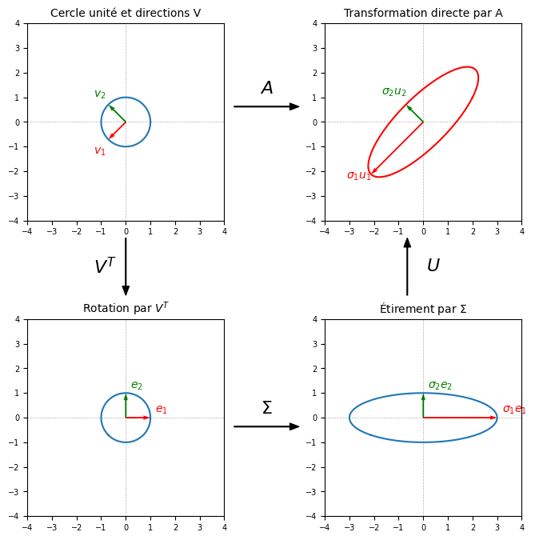

# 3. Décomposition en Valeurs Singulières

Soit $A \in \mathbb{R}^{m \times n}$ une matrice rectangulaire de rang $r$. Il existe une factorisation de la forme :

$$
\underset{m \times n}{A} = \underset{m \times m}{U} \cdot \underset{m \times n}{\Sigma} \cdot \underset{n \times n}{V^\top}
$$

avec les propriétés suivantes :

- $U \in \mathbb{R}^{m \times m}$ est une matrice orthogonale. Ses colonnes $u_i$ sont appelées les vecteurs singuliers à gauche.
- $V \in \mathbb{R}^{n \times n}$ est une matrice orthogonale. Ses colonnes $v_j$ sont appelées les vecteurs singuliers à droite.
- $\Sigma \in \mathbb{R}^{m \times n}$ est une matrice rectangulaire dont les éléments diagonaux $\Sigma_{ii} = \sigma_i \ge 0$ sont appelés les valeurs singulières. Les valeurs singulières sont ordonnées par ordre décroissant : $\sigma_1 \ge \sigma_2 \ge \dots \ge \sigma_r > 0$.

De plus, la multiplication colonnes-lignes permet de séparer la matrice $A$ en une somme de $r$ matrices de rang 1 :

$$
A = U \Sigma V^{\top} = \sigma_1 u_1 v_1^{\top} + \sigma_2 u_2 v_2^{\top} + \dots + \sigma_r u_r v_r^{\top} = \sum_{i=1}^{r} \sigma_i u_i v_i^{\top}
$$

Chaque terme de cette somme, $\sigma_i u_i v_i^{\top}$, représente une matrice de rang 1. Dans une telle structure, toutes les colonnes de la matrice résultante sont des multiples scalaires du vecteur $u_i$. Par conséquent, la dimension de l'espace des colonnes est de 1, ce qui confirme que le rang de chaque matrice est exactement égal à 1.

**Construction et Lien avec la Matrice Symétrique**

Cette relation est fondamentale pour le calcul pratique de la DVS. Nous examinons la matrice symétrique $A^\top A$. Puisque $A^\top A$ est symétrique, la diagonalisation est possible grâce au Théorème Spectral. Supposons que $A = U \Sigma V^\top$. Calculons $A^\top A$ :

\begin{align*}
    A^\top A & = (U \Sigma V^\top)^\top (U \Sigma V^\top)              \\
             & = V \Sigma^\top \underbrace{U^\top U}_{I} \Sigma V^\top \\
             & = V (\Sigma^\top \Sigma) V^\top.
\end{align*}

D'après le théorème spectral, la matrice symétrique $A^\top A$ est diagonalisable orthogonalement sous la forme $A^\top A = P D P^\top$.
En identifiant les termes, nous obtenons deux résultats fondamentaux :

1. Les colonnes de $V$ sont les vecteurs propres de $A^\top A$.
2. Les éléments diagonaux de $\Sigma^\top \Sigma$ qui est une matrice carrée (soit $\sigma_i^2$) sont les valeurs propres de $A^\top A$. Ainsi, $\sigma_i = \sqrt{\lambda_i}$.
3. Pour obtenir des vecteurs orthonormés $u_i$, il suffit de normaliser les vecteurs $Av_i$. La norme de $Av_i$ est donnée par $\|Av_i\| = \sqrt{\lambda_i} = \sigma_i$. Ainsi, nous définissons les vecteurs singuliers à gauche comme suit :

   $$
   u_i = \frac{Av_i}{\|Av_i\|} = \frac{1}{\sigma_i} A v_i.
   $$

```{admonition} Exemple
:class: seealso
Considérons la matrice $A = \begin{bmatrix} 1 & 0 & 1 \\ -2 & 1 & 0 \end{bmatrix}$.
```

Calculons $A^\top A$ et ses vecteurs propres :

$$
A^\top A = \begin{bmatrix} 5 & -2 & 1 \\ -2 & 1 & 0 \\ 1 & 0 & 1 \end{bmatrix}.
$$

Les valeurs propres sont $\lambda_1=6, \lambda_2=1, \lambda_3=0$. Les vecteurs propres normalisés forment $V$ :

$$
v_1 = \frac{1}{\sqrt{30}}(5, -2, 1)^\top, \quad v_2 = \frac{1}{\sqrt{5}}(0, 1, 2)^\top, \quad v_3 = \frac{1}{\sqrt{6}}(-1, 2, 5)^\top.
$$

Les valeurs singulières sont les racines carrées des valeurs propres non nulles :

$$
\sigma_1 = \sqrt{6}, \quad \sigma_2 = 1. \implies \Sigma = \begin{bmatrix} \sqrt{6} & 0 & 0 \\ 0 & 1 & 0 \end{bmatrix}.
$$

Nous utilisons la relation $u_i = \frac{1}{\sigma_i} A v_i$ :

$$
u_1 = \frac{1}{\sqrt{6}} A v_1 = \frac{1}{\sqrt{5}} \begin{bmatrix} 1 \\ -2 \end{bmatrix}, \quad
u_2 = \frac{1}{1} A v_2 = \frac{1}{\sqrt{5}} \begin{bmatrix} 2 \\ 1 \end{bmatrix}.
$$

On obtient ainsi la décomposition complète $A = U \Sigma V^\top$.

Enfin, illustrons la décomposition de $A$ en une somme de matrices de rang 1 ($A = \sigma_1 u_1 v_1^{\top} + \sigma_2 u_2 v_2^{\top}$) :

$$A = \sqrt{6} \left( \frac{1}{\sqrt{5}} \begin{bmatrix} 1 \\ -2 \end{bmatrix} \right) \left( \frac{1}{\sqrt{30}} \begin{bmatrix} 5 & -2 & 1 \end{bmatrix} \right) + 1 \left( \frac{1}{\sqrt{5}} \begin{bmatrix} 2 \\ 1 \end{bmatrix} \right) \left( \frac{1}{\sqrt{5}} \begin{bmatrix} 0 & 1 & 2 \end{bmatrix} \right)$$

$$A = \frac{\sqrt{6}}{\sqrt{150}} \begin{bmatrix} 5 & -2 & 1 \\ -10 & 4 & -2 \end{bmatrix} + \frac{1}{5} \begin{bmatrix} 0 & 2 & 4 \\ 0 & 1 & 2 \end{bmatrix}$$

Sachant que $\frac{\sqrt{6}}{\sqrt{150}} = \frac{\sqrt{6}}{5\sqrt{6}} = \frac{1}{5}$, on obtient :

$$A = \begin{bmatrix} 1 & -0.4 & 0.2 \\ -2 & 0.8 & -0.4 \end{bmatrix} + \begin{bmatrix} 0 & 0.4 & 0.8 \\ 0 & 0.2 & 0.4 \end{bmatrix} = \begin{bmatrix} 1 & 0 & 1 \\ -2 & 1 & 0 \end{bmatrix}$$

La première matrice de cette somme, $A_1 = \begin{bmatrix} 1 & -0.4 & 0.2 \\ -2 & 0.8 & -0.4 \end{bmatrix}$, représente la meilleure approximation de rang 1 de la matrice $A$.

*Source : Deisenroth, Faisal & Ong, "Mathematics for Machine Learning", Cambridge University Press, 2020 — voir [Références](references.md).*

## Géométrie de la DVS

La DVS décompose une matrice sous la forme $A = U\Sigma V^{\top}$ : **(orthogonale)** $\times$ **(diagonale)** $\times$ **(orthogonale)**. Les matrices orthogonales $U$ et $V$ appliquent une rotation au plan. La matrice diagonale $\Sigma$ l'étire le long des axes.

Afin d'illustrer visuellement les étapes de la DVS, nous avons généré la figure suivante à l'aide d'un script Python.



*Illustration géométrique de la DVS générée via Python.*

## Le Premier Vecteur Singulier $v_1$

Nous avons défini les vecteurs singuliers à droite $v_i$ comme étant les vecteurs propres de la matrice $A^{\top} A$. Nous comprendrons ces vecteurs singuliers un par un, de manière séquentielle, au lieu de les considérer tous en même temps. Commençons par le premier vecteur singulier $v_1$ et sa valeur singulière associée $\sigma_1$.

Cette approche consiste à chercher la direction dans laquelle la matrice $A$ étire le plus les vecteurs. Cela revient à maximiser le ratio suivant :

\begin{equation}
    \max_{x \neq 0} \frac{\|Ax\|}{\|x\|} = \sigma_1
\end{equation}

## Le Quotient de Rayleigh

Jusqu'à présent, nous avons défini la DVS en supposant l'existence de la décomposition. Supposons que nous ne connaissons ni $U$, ni $\Sigma$, ni $V$.
Nous cherchons à maximiser le ratio $\frac{\|Ax\|}{\|x\|}$. Pour trouver un maximum, la méthode standard consiste à calculer la dérivée de la fonction et à l'égaler à zéro. Comme la norme euclidienne contient une racine carrée, les calculs deviennent plus compliqués. Pour simplifier, on maximise le carré de la fonction (qui a le même maximum), ce qui nous conduit au Quotient de Rayleigh :

\begin{equation}
    \max_{x \neq 0} \frac{\|Ax\|^2}{\|x\|^2} = \max_{x \neq 0} \frac{(Ax)^{\top} (Ax)}{x^{\top} x} = \max_{x \neq 0} \frac{x^{\top} A^{\top} A x}{x_1^2 + x_2^2 + \dots + x_n^2} = \max_{x \neq 0} \frac{x^{\top} S x}{x^{\top} x}
\end{equation}

où $S = A^{\top} A$ est une matrice symétrique.

Pour trouver ce maximum, nous devons calculer les dérivées partielles par rapport à chaque composante $x_i$ et les égaler à zéro. Calculons d'abord les dérivées du dénominateur et du numérateur séparément :

$$\frac{\partial}{\partial x_i} (x^{\top} x) = \frac{\partial}{\partial x_i} (x_1^2 + \dots + x_n^2) = 2x_i$$

$$\frac{\partial}{\partial x_i} (x^{\top} S x) = \frac{\partial}{\partial x_i} \left( \sum_i \sum_j S_{ij} x_i x_j \right) = 2 \sum_j S_{ij} x_j = 2(Sx)_i$$

Pour trouver ce maximum, nous devons calculer les dérivées partielles par rapport à chaque composante $x_i$ et les égaliser à zéro. Calculons d'abord les dérivées du dénominateur et du numérateur séparément :

$$\frac{\partial}{\partial x_i} (x^{\top} x) = \frac{\partial}{\partial x_i} (x_1^2 + \dots + x_n^2) = 2x_i$$

$$\frac{\partial}{\partial x_i} (x^{\top} S x) = \frac{\partial}{\partial x_i} \left( \sum_i \sum_j S_{ij} x_i x_j \right) = 2 \sum_j S_{ij} x_j = 2(Sx)_i$$

Ensuite, nous appliquons la règle de dérivation d'un quotient ($\frac{f'g - fg'}{g^2} = 0 \implies f'g - fg' = 0$). Pour que la dérivée globale soit nulle, le numérateur de cette dérivée doit obligatoirement s'annuler. Cela nous donne l'équation suivante :

$$x^{\top} x \cdot (2Sx) - (x^{\top} Sx) \cdot 2x = 0$$

Nous pouvons maintenant simplifier cette équation. En divisant chaque terme par $2$ et en réorganisant, nous obtenons :

$$(x^{\top} x) Sx = (x^{\top} Sx) x$$

Divisons ensuite les deux côtés par $(x^{\top} x)$ :

$$\frac{(x^{\top} x) Sx}{x^{\top} x} = \frac{(x^{\top} Sx) x}{x^{\top} x}$$

Ce qui se simplifie pour donner notre résultat final :

$$Sx = \left( \frac{x^{\top} Sx}{x^{\top} x} \right) x$$

Elle correspond exactement à la définition d'une équation aux valeurs propres ($Sx = \lambda x$). Par conséquent :

- Le vecteur $x$ qui maximise notre ratio est par définition un vecteur propre de $S$ (notre premier vecteur singulier $v_1$).
- Le terme entre grandes parenthèses, qui représente notre maximum, est la valeur propre $\lambda$ correspondante (qui est égale à $\sigma_1^2$).

```{admonition} Exemple
:class: seealso
Dans l'Exemple 8, nous avions effectué la décomposition en valeurs singulières de la matrice $A$, et nous avions trouvé le premier vecteur singulier $v_1$ ainsi que la valeur singulière maximale $\sigma_1 = \sqrt{6}$. Appliquons maintenant le Quotient de Rayleigh.
```

Rappelons notre matrice symétrique $S = A^{\top} A$ de l'exemple 8 :

$$S = \begin{bmatrix} 5 & -2 & 1 \\ -2 & 1 & 0 \\ 1 & 0 & 1 \end{bmatrix}$$

Nous voulons montrer que le quotient de Rayleigh atteint sa valeur maximale dans la direction du premier vecteur singulier $v_1$. Pour faciliter les calculs, il n'est pas nécessaire de rendre le vecteur unitaire ; en effet, dans le quotient de Rayleigh, la longueur du vecteur n'a pas d'importance, seule sa direction compte. C'est pourquoi nous utilisons directement notre vecteur non normalisé :

Étape 1 : Calcul du dénominateur (la norme au carré du vecteur) :
$$x^{\top} x = 5^2 + (-2)^2 + 1^2 = 25 + 4 + 1 = 30$$

Étape 2 : Calcul du produit matrice-vecteur $Sx$ :
$$Sx = \begin{bmatrix} 5 & -2 & 1 \\ -2 & 1 & 0 \\ 1 & 0 & 1 \end{bmatrix} \begin{bmatrix} 5 \\ -2 \\ 1 \end{bmatrix} = \begin{bmatrix} (25 + 4 + 1) \\ (-10 - 2 + 0) \\ (5 + 0 + 1) \end{bmatrix} = \begin{bmatrix} 30 \\ -12 \\ 6 \end{bmatrix}$$

Étape 3 : Calcul du numérateur $x^{\top} S x$ :
$$x^{\top} S x = \begin{bmatrix} 5 & -2 & 1 \end{bmatrix} \begin{bmatrix} 30 \\ -12 \\ 6 \end{bmatrix} = (5 \times 30) + (-2 \times -12) + (1 \times 6) = 150 + 24 + 6 = 180$$

Étape 4 : Quotient de Rayleigh :
$$\frac{x^{\top} S x}{x^{\top} x} = \frac{180}{30} = 6$$

Le résultat de ce quotient est très exactement $6$. Cela correspond à notre plus grande valeur propre $\lambda_1 = 6$, ce qui confirme que $\lambda_1 = \sigma_1^2 = (\sqrt{6})^2 = 6$. Nous avons ainsi vérifie numériquement que le quotient de Rayleigh trouve la variance maximale exactement dans la direction du premier vecteur singulier $v_1$.

```{admonition} Définition (Norme Spectrale d'une Matrice)
:class: tip
Pour tout vecteur $x \in \mathbb{R}^n \setminus \{0\}$, la norme spectrale d'une matrice $A \in \mathbb{R}^{m \times n}$ est définie par :

\begin{equation}
    \|A\|_2 := \max_{x \neq 0} \frac{\|Ax\|_2}{\|x\|_2}
\end{equation}
```

```{admonition} Définition (Norme de Frobenius)
:class: tip
Pour une matrice $A \in \R^{m \times n}$ de rang $r$, elle est définie par la racine carrée de la somme des carrés de ses valeurs singulières :

\begin{equation}
    \|A\|_F = \sqrt{\sigma_1^2 + \sigma_2^2 + \dots + \sigma_r^2} = \sqrt{\sum_{i=1}^{r} \sigma_i^2}
\end{equation}
```

```{admonition} Théorème
:class: important
La norme spectrale de $A$ est sa plus grande valeur singulière $\sigma_1$.
```

```{admonition} Démonstration
D'après la définition de la norme spectrale :
$$ \|A\|_2 = \max_{x \neq 0} \frac{\|Ax\|_2}{\|x\|_2}. $$

Pour simplifier les calculs, nous en prenons le carré :
$$ \|A\|_2^2 = \max_{x \neq 0} \frac{\|Ax\|_2^2}{\|x\|_2^2} = \max_{x \neq 0} \frac{x^{\top} A^{\top} A x}{x^{\top} x} = \max_{x \neq 0} R(x), $$
où $R(x)$ est le quotient de Rayleigh pour la matrice $S = A^{\top} A$.

Le maximum du quotient de Rayleigh est atteint dans la direction du vecteur propre correspondant à la plus grande valeur propre $\lambda_1$ de $S$. Par conséquent :
$$ \|A\|_2^2 = \lambda_1. $$

D'après la DVS, les valeurs propres de $S$ sont les carrés des valeurs singulières de $A$ : $\lambda_1 = \sigma_1^2$. En conclusion :
$$ \|A\|_2 = \sigma_1. $$
```
