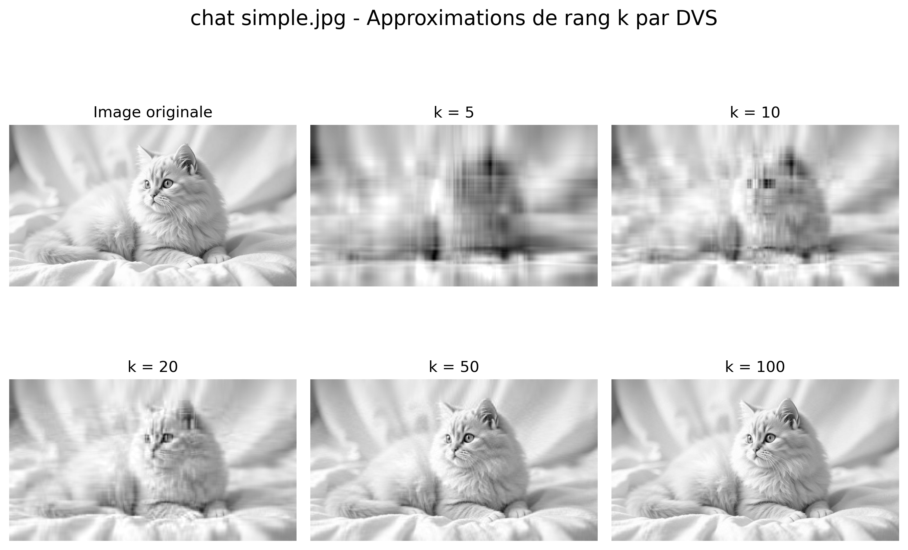
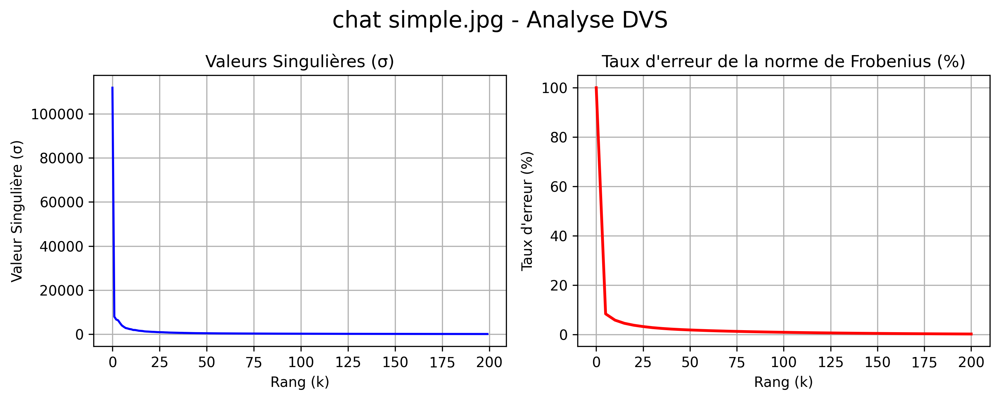
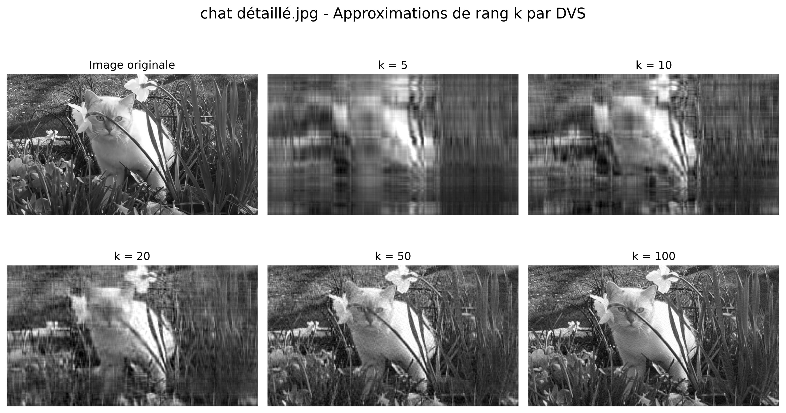
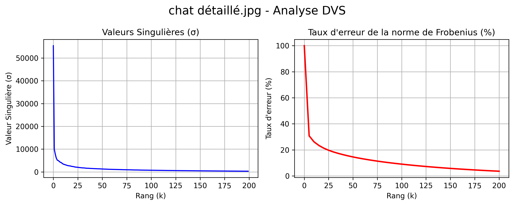
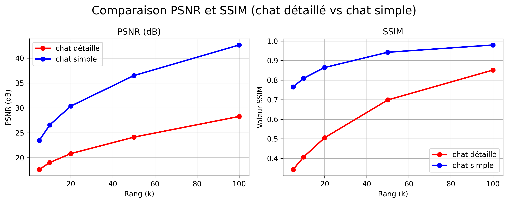

# 4. Application de la DVS à la Compression d'Images

Dans cette section, nous mettons en évidence le lien direct entre l'approximation matricielle optimale et la compression de données à l'aide de la décomposition en valeurs singulières (DVS). Une image en niveaux de gris peut être modélisée mathématiquement par une matrice réelle $A \in \mathbf{R}^{n \times m}$, où $n$ et $m$ représentent respectivement le nombre de pixels verticaux et horizontaux. Grâce à la DVS, la matrice originale est décomposée selon ses composantes singulières sous la forme $A = U \Sigma V^{\top}$.

D'après le théorème d'Eckart–Young, la meilleure approximation de rang $k$ s'obtient en conservant uniquement les $k$ plus grandes valeurs singulières et leurs vecteurs singuliers associés. Sous les normes spectrale et de Frobenius, les valeurs singulières négligées ($\sigma_{k+1}, \dots, \sigma_r$) sont alors interprétées mathématiquement comme du bruit (*noise*), ce qui permet de réaliser une réduction de dimension optimale tout en minimisant la perte d'information résiduelle.

Afin d'illustrer ce concept théorique en pratique, nous analysons deux images en niveaux de gris de dimensions $736 \times 414$ pixels, dont la matrice initiale est de rang égal à $414$. Nous appliquons la DVS pour reconstruire les matrices approximatives $A_k$ pour différentes valeurs de rang $k \in \{5, 10, 20, 50, 100\}$.

Enfin, nous procéderons à une analyse comparative des approximations obtenues pour ces deux images distinctes de mêmes dimensions, sous les mêmes valeurs de rang $k$.

L'image montre un chat sur un arrière-plan doux (avec très peu de détails). En observant les différentes approximations de rang, l'évolution de la reconstruction est évidente :

- Pour $k=5$ et $k=10$, l'image est floue et présente d'importants effets de blocs.
- À $k=20$, on distingue déjà très facilement la silhouette du chat.
- À $k=50$, on obtient une image très proche de l'originale.
- À $k=100$, la reconstruction est visuellement presque identique à l'image originale.

Sur le graphique des valeurs singulières, on observe une décroissance très rapide. Les toutes premières valeurs singulières sont largement dominantes, tandis que les suivantes diminuent drastiquement. Cela signifie que la plus grande partie de l'énergie (c'est-à-dire l'information essentielle de l'image) est concentrée dans ces premières valeurs singulières.

Le graphique de l'erreur relative suit exactement cette même tendance. Étant donné que les premières valeurs singulières contiennent l'essentiel de l'énergie de l'image et que les valeurs suivantes sont extrêmement petites, l'erreur tend très rapidement vers zéro à mesure que le rang $k$ augmente.

L'image montre un chat sur un arrière-plan complexe (végétation, texture dense). En observant les différentes approximations de rang, on constate que :

- À $k=20$, on peut distinguer le chat et son environnement, mais la complexité des traits du visage du chat n'est pas encore résolue.
- À $k=50$, le rendu est un peu plus net. Cependant, comparé au chat précédent (qui possédait un arrière-plan doux), la plupart des détails fins restent indiscernables.

Autrement dit, pour cette image complexe, une poignée de valeurs singulières ne suffit absolument pas à la représenter fidèlement.

Sur le graphique de l'erreur relative en fonction du rang, on retrouve une courbe décroissante similaire. Toutefois, par rapport au premier chat, l'erreur est nettement plus élevée, en particulier dans l'intervalle de rang allant de $0$ à $25$. À titre d'exemple, pour la deuxième image, à $k \approx 25$, l'erreur est encore d'environ $20\%$, alors que pour la première image, au même rang $k$, elle est presque nulle.

Pour le premier chat, l'énergie est concentrée presque exclusivement dans les $20$ premières valeurs singulières. Tandis que pour le deuxième, il faut atteindre $k \approx 50$ ou plus pour obtenir la même fidélité. L'énergie mathématique est donc répartie sur un bien plus grand nombre de valeurs singulières.

Le PSNR mesure à quel point l'image compressée ressemble à l'originale : plus il est élevé, meilleure est la qualité (son unité est le décibel, dB). Mathématiquement, pour une image en niveaux de gris où l'intensité maximale d'un pixel est de $255$, le PSNR est défini à partir de l'erreur quadratique moyenne (MSE - *Mean Squared Error*) entre l'image originale $I$ et l'image reconstruite $K$, toutes deux de dimensions $m \times n$ :

\begin{equation}
    \text{MSE} = \frac{1}{mn} \sum_{i=1}^{m} \sum_{j=1}^{n} \left[ I(i,j) - K(i,j) \right]^2
\end{equation}

\begin{equation}
    \text{PSNR} = 10 \log_{10} \left( \frac{255^2}{\text{MSE}} \right) = 20 \log_{10} \left( \frac{255}{\sqrt{\text{MSE}}} \right)
\end{equation}

- **$> 40$ dB :** Qualité presque sans perte (la différence n'est pas visible à l'œil nu).
- **Entre $30$ et $40$ dB :** Bonne qualité.
- **Entre $20$ et $30$ dB :** Qualité moyenne (la dégradation commence à se voir).
- **$< 20$ dB :** Faible qualité.

Sur le graphique, le PSNR augmente avec $k$ pour les deux images, mais la courbe bleue (chat simple) est nettement au-dessus de la rouge (chat détaillé) en tout point. À $k=20$, chat simple atteint environ $30$ dB (bonne qualité) tandis que chat détaillé reste autour de $21$ dB (moyenne). De plus, l'écart se creuse à mesure que $k$ augmente : à $k=100$, chat simple atteint environ $42$ dB, soit une qualité presque parfaite, alors que chatdétaillé plafonne à environ $28$ dB. Autrement dit, l'image simple atteint une haute qualité avec peu de composantes, tandis que l'image complexe n'atteint pas la même qualité même en ajoutant davantage de composantes.

Le SSIM mesure la ressemblance non pas pixel par pixel, mais à partir de la structure perçue par l'œil humain (forme générale, contraste). Il est donc plus proche de la perception visuelle humaine que le PSNR. Il prend une valeur comprise entre $0$ et $1$ :

- **$1$** : Identique à l'originale.
- **$> 0{,}95$** : Excellente qualité (presque indiscernable à l'œil).
- **Entre $0{,}80$ et $0{,}95$** : Bonne qualité.
- **$\approx 0{,}50$** : Qualité moyenne (la dégradation est clairement visible).
- **Proche de $0$** : Structure très différente.

Sur le graphique, chat simple part déjà d'environ $0{,}77$ à $k=5$ (l'image est donc reconnaissable dès le départ) et atteint environ $0{,}94$ à $k=50$, où elle se stabilise presque. Au-delà de ce point, ajouter des composantes ne change plus guère la qualité. En revanche, chat détaillé reste très en retrait : à $k=20$, elle n'atteint qu'environ $0{,}51$ (à moitié ressemblante, l'image est encore floue), et même à $k=100$, elle ne monte qu'à environ $0{,}85$. L'écart le plus frappant s'observe à $k=5$ : chat simple est à environ $0{,}77$ alors que chat détaillé est à environ $0{,}35$.

Les deux donnent le même résultat: une image simple et peu bruitée atteint une haute qualité avec beaucoup moins de composantes, tandis qu'une image complexe et bruitée nécessite un nombre bien plus important de composantes pour atteindre cette même qualité, et parfois même, n'y parvient jamais complètement.

L'implication pratique est la suivante : si l'on fixe par exemple une contrainte de qualité de « minimum $30$ dB pour le PSNR », un rang de $k \approx 20$ est amplement suffisant pour l'image simple. En revanche, pour l'image complexe, même à $k=100$, ce seuil n'est pas atteint. Par conséquent, il n'existe pas un seul « bon » rang $k$ universel ; le choix du rang $k$ optimal dépend fondamentalement de la complexité intrinsèque de l'image à traiter.

## Comparaison des Résultats

Dans l'intervalle de rang $50$–$100$, on obtient pour les deux images des reconstructions très proches de l'originale, avec des taux d'énergie conservée très élevés : à $k=50$, environ $99{,}9\%$ pour chat simple et environ $98\%$ pour chat détaillé — les deux dépassent donc largement $90\%$. Pourtant, ces pourcentages ne semblent pas réalistes au premier abord : en particulier pour chat détaillé (arrière-plan complexe), on voit clairement qu'à $k=50$ beaucoup de petits détails manquent encore. Ce que dit le calcul ($98\%$ conservé) et ce que voit l'œil (image encore floue) semblent se contredire.

Cette contradiction vient de la manière dont l'« énergie » est définie. Dans une image en niveaux de gris, chaque pixel représente une intensité de luminosité comprise entre $0$ et $255$, et l'énergie totale est donnée par la norme de Frobenius, $\|A\|_F^2 = \sum_{i=1}^{r} \sigma_i^2$. Le taux d'énergie conservée par l'approximation de rang $k$ est alors le rapport $\dfrac{\sum_{i=1}^{k}\sigma_i^2}{\sum_{i=1}^{r}\sigma_i^2}$, c'est-à-dire les carrés des $k$ valeurs singulières retenues divisés par ceux de toutes les valeurs singulières d'origine. Or le terme associé à la plus grande valeur singulière porte la structure grossière de luminosité de l'image (par exemple : « ici un arrière-plan clair, là une masse plus sombre qui est le chat ») : ayant une forte amplitude et s'étendant sur toute l'image, il porte à lui seul la plus grande part de l'énergie, mais ne contient aucun détail fin. Les détails fins — contours, texture du pelage, moustaches, densité du feuillage — sont codés dans les petites valeurs singulières de la queue de la distribution ; comme leurs carrés sont minuscules, leur contribution à l'énergie est négligeable, alors que c'est précisément ce que l'œil perçoit comme la netteté.

C'est pourquoi, à $k=50$, dire « $98$–$99{,}9\%$ de l'énergie est conservée » ne signifie pas « $98$–$99{,}9\%$ de l'information visuelle est conservée ». La part restante de $0{,}1$–$2\%$ n'est pas répartie au hasard : elle est concentrée précisément dans les détails fins, qui sont les plus importants pour la perception humaine.

Les graphiques PSNR et SSIM confirment cette analyse. Pour chat détaillé, « $98\%$ d'énergie » semble parfait, mais une fois traduit en PSNR, cela ne donne à $k=50$ qu'environ $24$ dB (qualité moyenne) ; quant au SSIM, il ne reste qu'à environ $0{,}70$. Ainsi, quand l'énergie dit « presque complet », le SSIM dit « structurellement encore incomplet de façon visible ».
